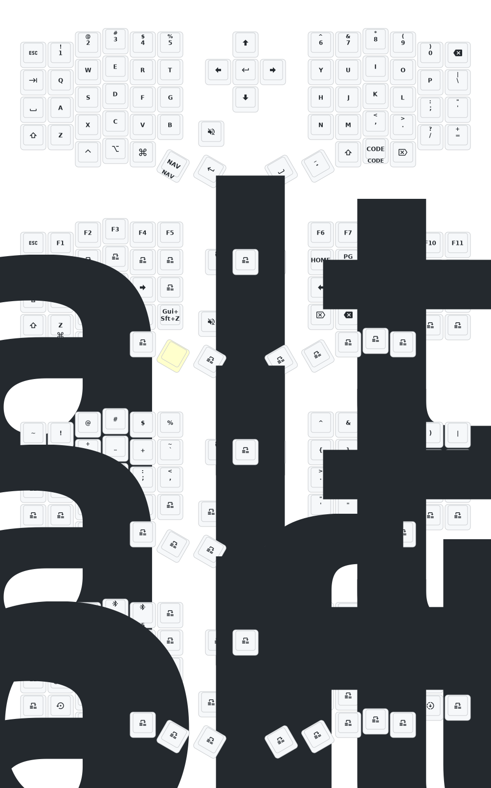

# 👾 Sofle Keyboard 👾

Here is my configuration guide for the Sofle v2 RGB Bluetooth keyboard kit (created by [@a741725193](https://github.com/a741725193/zmk-sofle)) as found on AliExpress or Taobao.

The Sofle is a 6x4+5 keys column-staggered split keyboard with encoder support, which has been [open sourced in 2020](https://josef-adamcik.cz/electronics/let-me-introduce-you-sofle-keyboard-split-keyboard-based-on-lily58.html) by [Josef Adamcik](https://josef-adamcik.cz/). It is based on [Lily58](https://github.com/kata0510/Lily58), [Corne](https://github.com/foostan/crkbd) and [Helix](https://github.com/MakotoKurauchi/helix) keyboards. You can find more details in the GitHub repo for the project and if you like to build it from scratch, here is the [build guide](https://josefadamcik.github.io/SofleKeyboard/build_guide.html).

This Sofle kit is a great and affordable starting point if you want to get into the world of split keyboards but don't yet want to do any soldering.


## What you will need

**1. Case & PCB**

- [Sofle on AliExpress](https://s.click.aliexpress.com/e/_ooUVBk5)
  - NOTE: there are multiple sellers offering the same, but the keyboard builds are ultimately from the same person
- Version 2 of the Sofle only supports MX switches that can be hot swapped
- You will need 58 switches & keycaps
- Bluetooth chip used is the https://www.nordicsemi.com/Products/nRF52840

**2. Switches**

- [Y3 on AliExpress](https://s.click.aliexpress.com/e/_okfiSdT)
- Any MX switches will work, I'm using Y3 linear switches https://www.aliexpress.com/item/1005007821220888.html with an actuation force of 48g

**3. Keycaps**

- I use a combination of keycap sets:
  - [SA profile black/yellow PBT keycaps on AliExpress](https://s.click.aliexpress.com/e/_onvZN6v)
  - [XDA profile white/yellow PBT keycaps on AliExpress](https://s.click.aliexpress.com/e/_oovVSRn)

## How to get started

Once you have everything, assembly is easy and fully plug & play. After you've inserted the switches and installed the keycaps, you can turn on both sides of the keyboard using the middle switch, and then go to Bluetooth in your settings and pair the device. You can find the default keymap configuration [here](https://github.com/a741725193/zmk-sofle).

### Firmware

Contrary to the original Sofle, this version uses [ZMK](https://zmk.dev) instead of [QMK](https://qmk.fm), which as far as I know is mainly due to better support for wireless using Bluetooth. _"ZMK Firmware is an open source (MIT) keyboard firmware built on the [Zephyr™ Project](https://zephyrproject.org/) Real Time Operating System (RTOS). ZMK's goal is to provide a modern and powerful firmware that is designed for power-efficiency, flexibility, and broad hardware support. ZMK is capable of being used for both wired and wireless input devices."_

### Folder structure

```shell
.
├── boards/arm/eyelash_sofle        # Board definition and configuration files for the Sofle keyboard hardware
│ ├── board.cmake                   # CMake build script for board-specific build instructions
│ ├── eyelash_sofle_left_defconfig  # Default configuration for the left half of the keyboard
│ ├── eyelash_sofle_right_defconfig # Default configuration for the right half of the keyboard
│ ├── eyelash_sofle_left.dts        # Device tree source for the left half (hardware layout and connections)
│ ├── eyelash_sofle_right.dts       # Device tree source for the right half
│ ├── eyelash_sofle-layouts.dtsi    # Shared device tree include for key layouts
│ ├── eyelash_sofle.dtsi            # Main device tree include for board hardware definitions
│ ├── eyelash_sofle.keymap          # Keymap file for the board (ZMK format)
│ ├── eyelash_sofle.yaml            # Board metadata/configuration in YAML format
│ ├── eyelash_sofle.zmk.yml         # ZMK-specific board configuration in YAML
│ ├── Kconfig.board                 # Kconfig options for board selection
│ ├── Kconfig.defconfig             # Default Kconfig options for the board
│
├── config                          # Configuration and keymap files
│ ├── eyelash_sofle.conf            # Main ZMK configuration for the Sofle board
│ ├── eyelash_sofle.json            # Keymap and layout in JSON format (for visualization/tools)
│ ├── eyelash_sofle.keymap          # Keymap file for firmware (ZMK format)
│ └── west.yml                      # West manifest for managing Zephyr/ZMK modules and dependencies
│
├── keymap-drawer                   # Keymap visualizations and YAML definitions for documentation and tools
│ ├── eyelash_sofle.svg             # SVG visualization of the Sofle keymap
│ └── eyelash_sofle.yaml            # YAML definition of the Sofle keymap (for keymap-drawer)
│
├── zephyr
│ └── module.yml                    # Zephyr module configuration for ZMK integration
```

### Customizing keymap

If you want to customize the keymap, you have three options:

**1. [ZMK Studio](https://zmk.studio)**

- Allows you to do runtime keymap configuration for ZMK devices i.e., you can make changes without the need to flash new firmware onto your keyboard
- First MVP released to the general public in November 2024, does not yet support all ZMK features
- Here is a list of features currently supported: https://zmk.dev/docs/features/studio#capabilities
- NOTE: ZMK Studio does not yet support export `.keymap` files, hence, many people suggest to first try out your keymap layout with ZMK Studio and once you like it port over the changes to a `.keymap` file so that you can compile a custom ZMK firmware, version control the configuration and flash your keyboard with this firmware.

**2. [nickcoutsos/keymap-editor](https://github.com/nickcoutsos/keymap-editor)**

- A web based graphical editor of ZMK keymaps, which leverages GitHub Actions to compile the firmware.
- You can try it here: https://nickcoutsos.github.io/keymap-editor/
- Created in August 2020 and since July 2023 the source code is no longer updated as commercial entities have branded and used this project to sell their ZMK based keyboards without contributing back to the original `keymap-editor` project. Hence, the original author [@nickcoutsos](https://github.com/nickcoutsos) decided to pull the plug and no longer make updates to the source code available publicly.
- NOTE: If you want to use the updated Keymap-Editor app you will need to authorize it with your GitHub account so that it can push updates and trigger the GitHub Action.
- If you do not want this you could self-host an older version of `keymap-editor` from when the source code was shared or do a firmware update without the graphical editor as described in option 3

**3. [Manually flashing ZMK firmware](https://zmk.dev/docs/user-setup)**

**Option 1: Building on GitHub Actions**

- This is the recommended process of setting up and configuring ZMK as described in the documentation
- NOTE: If you've forked this repository, you can manually edit the [eyelash_sofle.keymap](./config/eyelash_sofle.keymap) file and push any changes, which will trigger GitHub actions to build the new firmware file

Once the GitHub Action pipeline has completed, you can download all firmware files.

**Option 2: Building locally**

You can also build the firmware on your local machine using Docker. Please find the official instructions to set up your environment [here](https://zmk.dev/docs/development/local-toolchain/setup/container).

These are the commands you will need to run:

```shell
# Clone ZMK firmware repository and ensure all commands are run from this folder
git clone git@github.com:zmkfirmware/zmk.git

cd zmk
```

```shell
docker volume create --driver local -o o=bind -o type=none -o device="/Users/tobias/Development/oss/zmk-sofle-keyboard/config" zmk-config
docker volume create --driver local -o o=bind -o type=none -o device="/Users/tobias/Development/oss/zmk-sofle-keyboard/" zmk-modules

# Start the container and open a shell session
docker exec -w /workspaces/zmk -it $(devcontainer up --workspace-folder "/Users/tobias/Development/forks/zmk" | jq -r '.containerId') /bin/bash
```

```shell
cp /workspaces/zmk-config/west.yml app/west.yml

west init -l app/ # Initialization
west update       # Update modules

# Restart container
exit
```

```shell
docker restart <container-id>
docker exec -w /workspaces/zmk/app -it <container-id> /bin/bash
```

```shell
# Build firmware
west build -d build/left -p -b eyelash_sofle_left -- -DSHIELD=nice_view -DZMK_EXTRA_MODULES="/workspaces/zmk-modules/" -DZMK_CONFIG="/workspaces/zmk-config/"
west build -d build/right -p -b eyelash_sofle_right -- -DSHIELD=nice_view_custom -DZMK_EXTRA_MODULES="/workspaces/zmk-modules/"
west build -d build/studio_left -p -b eyelash_sofle_left -- -DSHIELD=nice_view -DZMK_EXTRA_MODULES="/workspaces/zmk-modules/" -DCONFIG_ZMK_STUDIO=y -DCONFIG_ZMK_STUDIO_LOCKING=n -DZMK_CONFIG="/workspaces/zmk-config/"
west build -d build/settings_reset_left -p -b eyelash_sofle_left -- -DSHIELD=settings_reset -DZMK_EXTRA_MODULES="/workspaces/zmk-modules/" -DZMK_CONFIG="/workspaces/zmk-config/"
west build -d build/settings_reset_right -p -b eyelash_sofle_right -- -DSHIELD=settings_reset -DZMK_EXTRA_MODULES="/workspaces/zmk-modules/" -DZMK_CONFIG="/workspaces/zmk-config/"

# Copy firmware to build/ directory
cp build/left/zephyr/zmk.uf2 /workspaces/zmk-modules/build/nice_view-eyelash_sofle_left-zmk.uf2
cp build/right/zephyr/zmk.uf2 /workspaces/zmk-modules/build/nice_view_custom-eyelash_sofle_right-zmk.uf2
cp build/studio_left/zephyr/zmk.uf2 /workspaces/zmk-modules/build/eyelash_sofle_studio_left.uf2
cp build/settings_reset_left/zephyr/zmk.uf2 /workspaces/zmk-modules/build/settings_reset-eyelash_sofle_left-zmk.uf2
cp build/settings_reset_right/zephyr/zmk.uf2 /workspaces/zmk-modules/build/settings_reset-eyelash_sofle_right-zmk.uf2
```

**Loading the firmware to your keyboard**

_"Then put your board into bootloader mode by double clicking the reset button (either on the MCU board itself, or the one that is part of your keyboard). The controller should appear in your OS as a new USB storage device."_

_"Once this happens, copy the correct UF2 file (e.g. left or right if working on a split), and paste it onto the root of that USB mass storage device. Once the flash is complete, the controller should unmount the USB storage, automatically restart and load your newly flashed firmware. It is recommended that you test your keyboard works over USB first to rule out hardware issues, before trying to connect to it wirelessly."_ Complete instructions can be found here: https://zmk.dev/docs/user-setup#installing-the-firmware

When flashing, it is very important to follow this exact sequence:

**Left side**

1. (Optional) Reset all settings `settings_reset-eyelash_sofle_left-zmk.uf2` (you will have to pair your keyboard again)
2. Flash the new keymap `nice_view-eyelash_sofle_left-zmk.uf2`
3. (Optional) Enable ZMK Studio support by flashing `eyelash_sofle_studio_left.uf2`

**Right side**

4. (Optional) Reset all settings `settings_reset-eyelash_sofle_right-zmk.uf2`. If you've reset the left side, you'll also have to reset the right side so that both sides can find each other
5. Flash the new keymap `nice_view_custom-eyelash_sofle_right-zmk.uf2`

For more context, these Reddit threads are helpful (they apply to the Corne but the Sofle is from the same vendor):

- https://www.reddit.com/r/ErgoMechKeyboards/comments/1ju67yx/aliexpress_eyelash_corne_basic_beginner_guide/
- https://www.reddit.com/r/ErgoMechKeyboards/comments/1hgs176/what_to_expect_from_the_cheapest_aliexpress_corne/

### Current keymap configuration



## Changelog

- 2025/3/30
  1. Increase sleep entry time by 1 hour, increase debounce time, optimize post-sleep power consumption.
- 2024/12/21
  1. Added support for zmk-studio (just refresh the left hand to use).
- 2024/10/24
  1. Modified power supply mode to reduce power consumption.
  2. Fixed the automatic shut-off feature for RGB power supply.

> If your keyboard was updated before October 24, please update to the latest firmware.

For 3D printed model files or any issues and malfunctions with the keyboard, please contact 380465425@qq.com
